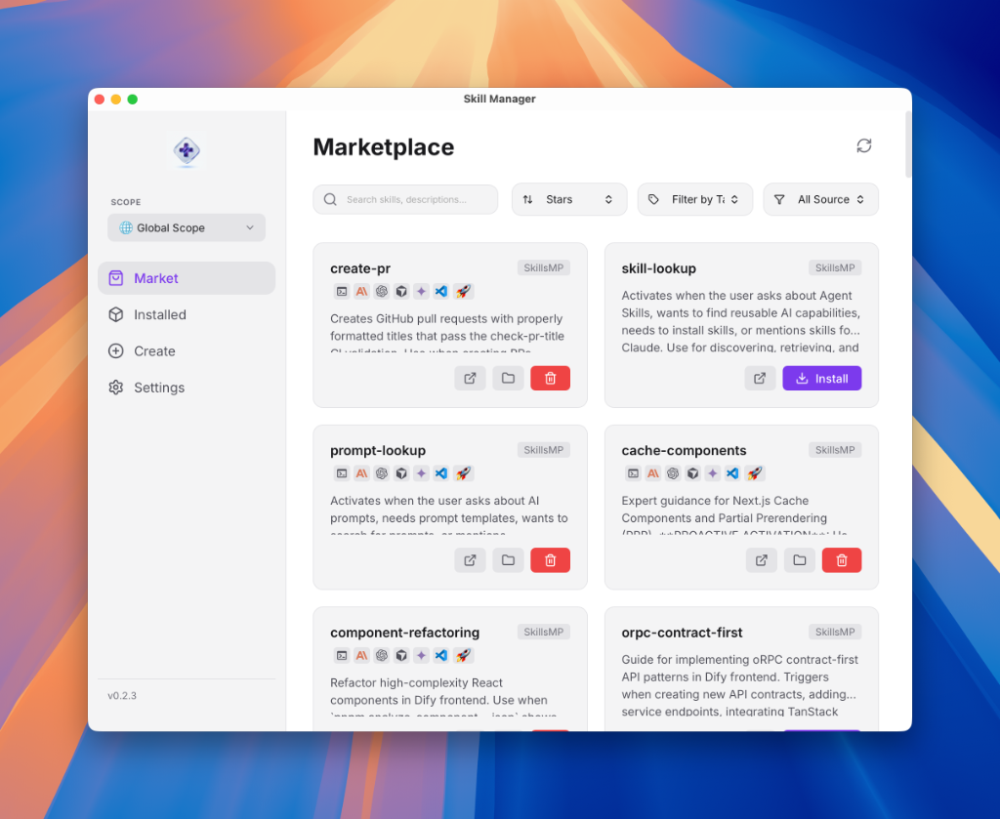
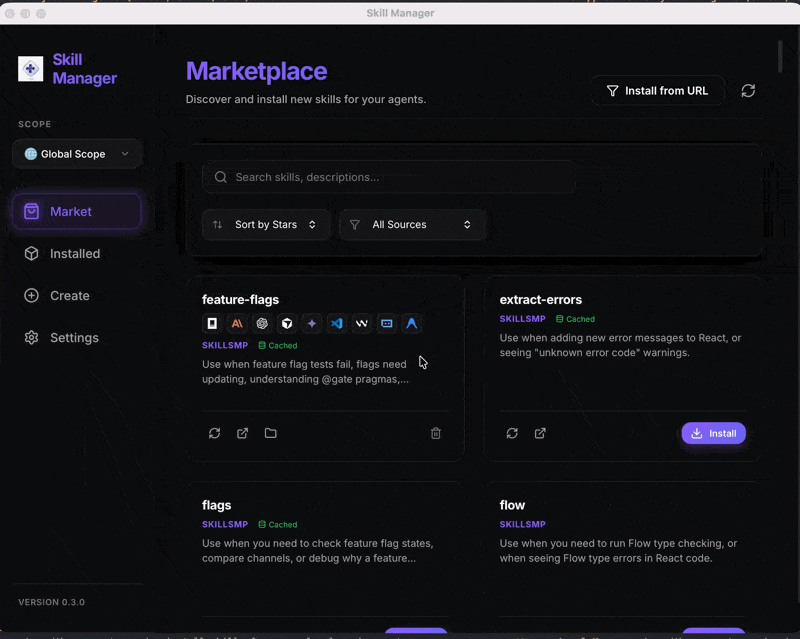
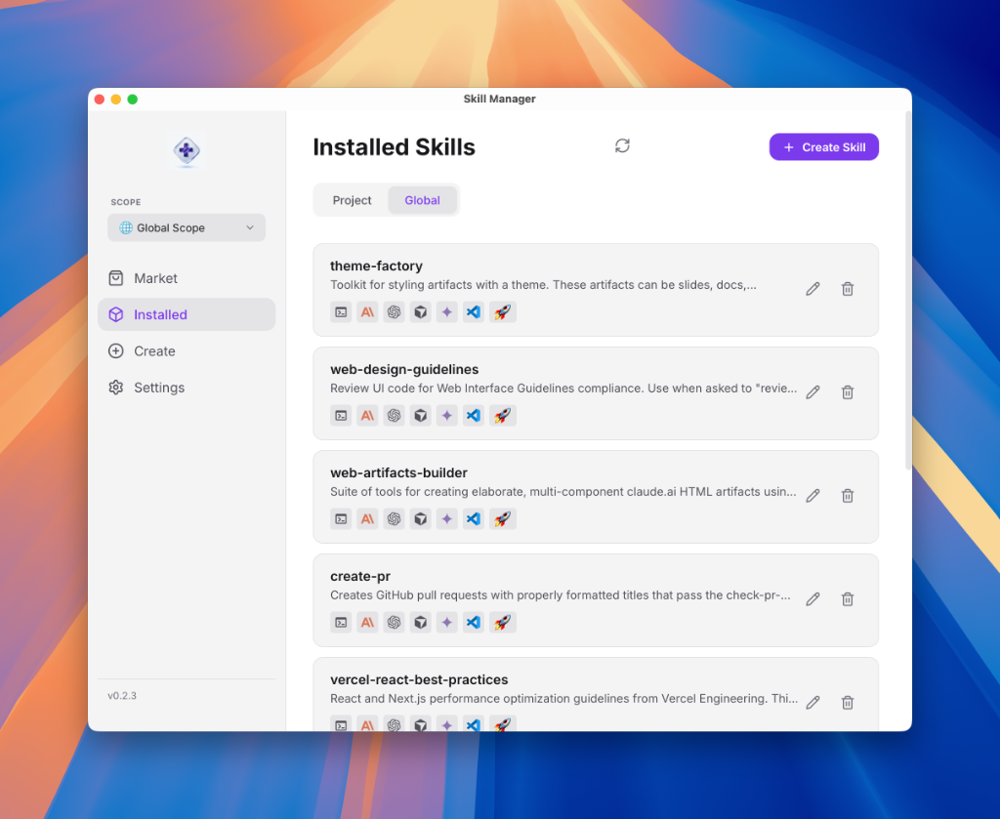
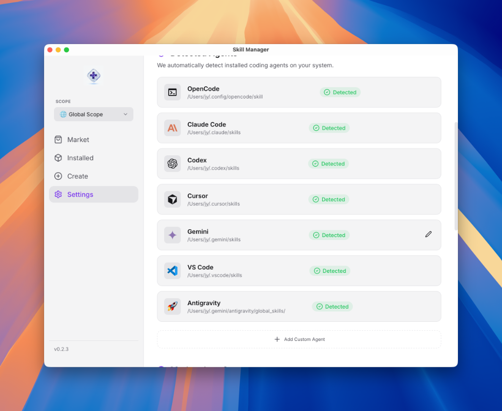

# Skill Manager 🧠

[English](./README.md) | [中文](./README.zh-CN.md)

**Skill Manager** 是一款强大的桌面应用程序，基于 Tauri、Vue 3 和 Rust 构建，旨在为各种 AI 代理（Anthropic、Claude Code、OpenCode、Cursor 等）管理技能（Skills）。

## 📸 截图

<p align="center">
  
</p>
<p align="center"><em>技能市场 - 浏览和发现来自多个来源的技能</em></p>

<p align="center">
  
</p>
<p align="center"><em>安装流程 - 一键安装技能</em></p>

<p align="center">
  
</p>
<p align="center"><em>已安装技能 - 管理您已安装的技能</em></p>

<p align="center">
  
</p>
<p align="center"><em>设置 - 自动检测已安装的 AI 编程代理</em></p>

## 🚀 功能特性

- **集中式市场**: 从多个官方和社区来源浏览和发现技能（SkillsMP, Anthropic 等）。
- **智能引导**: 自动检测已安装的代理（Cursor, VS Code 等）并提供一键配置。
- **改进的发现机制**:
  - 支持单技能仓库（如 `BH-M87/why-what-how-skill`）。
  - 递归发现 Monorepo 中的技能（如 `anthropics/skills`）。
- **安全优先**:
  - 卸载时提供确认弹窗，防止误操作。
  - 保护关键技能不被意外删除。
- **本地 MCP 管理器** (即将推出):
  - 可视化配置 Model Context Protocol服务器。
  - 在“开发模式”（Github/Postgres MCP）和“写作模式”之间即时切换。
- **多代理支持**: 一键将技能安装到 Cursor、VS Code、Claude 等。
- **高级获取方式**:
  - **Git 优先**: 直接克隆仓库以获取最新代码。
  - **HTTP 回退**: 如果 Git 不可用或需要身份验证，自动回退到 ZIP 下载。
  - **进度跟踪**: 实时反馈获取进度和来源信息。
- **本地管理**: 查看、创建和卸载本地环境中的技能。
- **持久缓存**: 更快的启动速度和市场元数据及源代码的离线访问。

## 📦 技能来源

市场聚合了来自多个高质量来源的技能：

- **Anthropic 官方**: Anthropic 代理的核心技能集。
- **Vercel Labs**: 实验性和前沿的代理技能。
- **社区来源**: 包含实用模板和工具的各种 GitHub 仓库。

## 🛠️ 开发

### 前置要求

- [Node.js](https://nodejs.org/) (v18+)
- [Rust](https://www.rust-lang.org/) (v1.75+)
- [Tauri CLI](https://tauri.app/v1/guides/getting-started/prerequisites)

### 设置

```bash
# 安装依赖
npm install

# 以开发模式运行
npm run tauri dev
```

### 技术栈

- **前端**: Vue 3、Pinia、Vite、TypeScript、Lucide Icons
- **后端**: Rust、Tauri、Reqwest (HTTP)、Tokio (异步)、Zip 解压

## 🛠️ 故障排除 (macOS)

如果在 macOS 上下载后遇到"应用已损坏"或"无法打开"错误，可以通过删除隔离属性来解决：

```bash
sudo xattr -rd com.apple.quarantine /Applications/Skill\ Manager.app
```

## 📄 许可证

MIT
